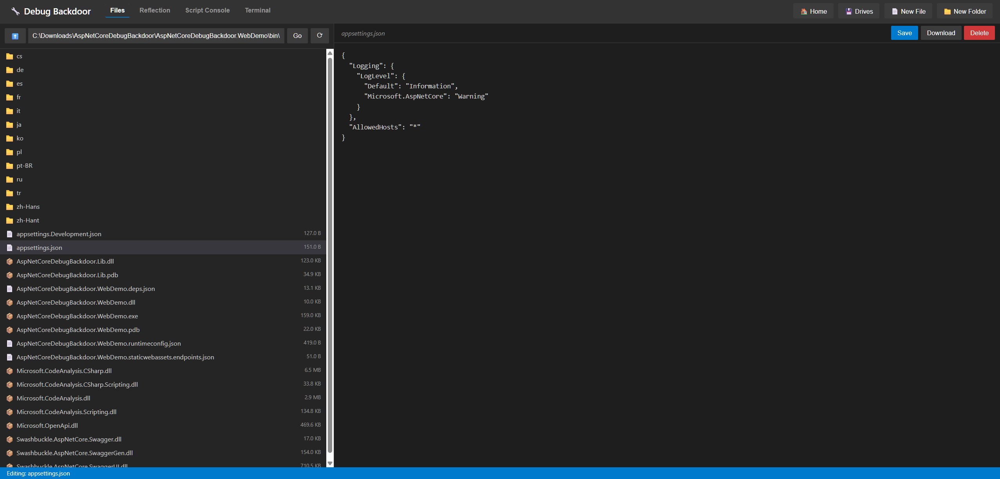
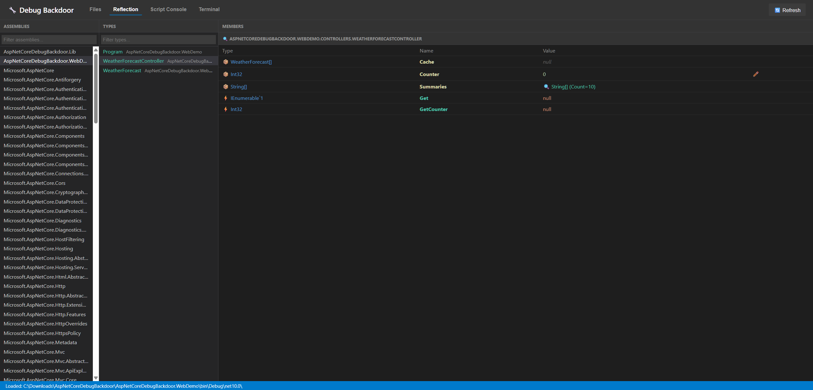
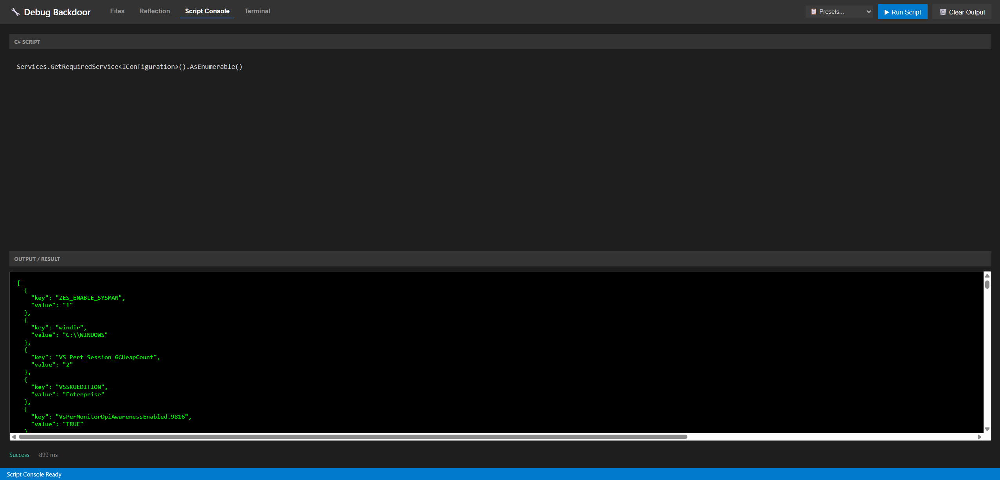
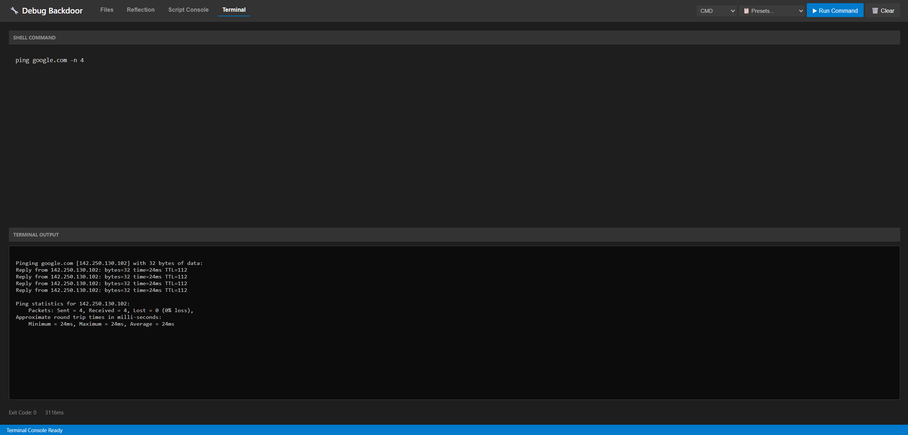

# 🔧 AspNetCore Debug Backdoor

**A powerful tool for deep debugging of ASP.NET Core applications in development environments.**

> ⚠️ **IMPORTANT**: Use this library ONLY in development environments! Never execute it in production!

## 🎯 Features

- **📁 File Manager**
  - 🌑 **Dark Theme UI** (VS Code style)
  - 🐧 **Cross-Platform** (Windows/Linux) support
  - 🖼️ **Image Preview** and text editing
  - 🖱️ **Context Menu** (Open, Delete, Navigation)
  - ⌨️ **Editor UX**: Tab key support and space-indentation.

- **🖥️ Script Console**
  - Execute arbitrary C# code at runtime with **Roslyn**.
  - ⚡ **Compilation Caching**: Fast re-execution of repeated scripts.
  - 🌐 **Global Access**: Access `Services` (IServiceProvider) and `Configuration` directly.
  - 📋 **Presets**: Dropdown with common snippets (assemblies, config, env).

- **⌨️ Terminal Console**
  - Execute **PowerShell**, **CMD**, and **Bash** commands.
  - 🔒 **Robust Execution**: Base64 encoding for PowerShell and filtered output.
  - 📋 **Terminal Presets**: Quick access to system tools (`ipconfig`, `ls`, etc.).
  - 🛡️ **Safe Cleanup**: Recursive process termination to prevent orphan children.

- **🔍 Reflection Inspector**
  - 🔎 **Deep Inspection**: Drill down into complex objects and collections.
  - ⚡ **Method Invocation**: Call methods with multiple parameters via a dynamic UI.
  - ✏️ **Runtime Editing**: Change primitive values at runtime.
  - 🧼 **Clean Metadata**: Filters out compiler-generated types (`<>c`) and backing fields.

- **🎨 Premium UI/UX**
  - 🔔 **Custom Modals**: Fully stylized Alert, Confirm, and Invoke dialogs.
  - 🚨 **Production Warning**: Automatic environment detection and warning banner.
  - 💾 **Persistence**: Remembers your active tab and navigation state across reloads.
  - ⚡ **High Performance**: Optimized rendering and tab-switching for large datasets.

- **✏️ TODO**
  - Publish to **NuGet**

## 🖼️ Images

### File Manager


### Reflection Inspector


### Script Console


### Terminal Console


## 🚀 Quick Start

### 1. Installation

Add a reference to the project:
```xml
<ItemGroup>
  <ProjectReference Include="..\AspNetCoreDebugBackdoor.Lib\AspNetCoreDebugBackdoor.Lib.csproj" />
</ItemGroup>
```

### 2. Basic Setup

```csharp
using AspNetCoreDebugBackdoor.Lib.Extensions;

var builder = WebApplication.CreateBuilder(args);

// Add controllers
builder.Services.AddControllers();

// Add Debug Backdoor with default settings
builder.Services.AddDebugBackdoor();

var app = builder.Build();

app.MapControllers();

app.Run();
```

### 3. Usage

Access the web interface at:
```
https://localhost:your-port/debug-backdoor
```

## 🔒 Security Configuration

You can restrict access and configure limits:

```csharp
builder.Services.AddDebugBackdoor(options =>
{
    // Limit access to specific paths
    options.AllowedPaths.Add(@"C:\MyProjects");
    options.AllowedPaths.Add(@"/home/user/projects");
    
    // Set maximum file size (default 10MB)
    options.MaxFileSizeBytes = 50 * 1024 * 1024;
    
    // Read-only mode
    options.EnableFileModification = false;
    
    // Restrict navigation to the application directory (More Secure)
    // Includes strict path validation to prevent traversal attacks
    options.UseAppDirectoryAsDefault = true;
});
```

## 📜 License

MIT License
